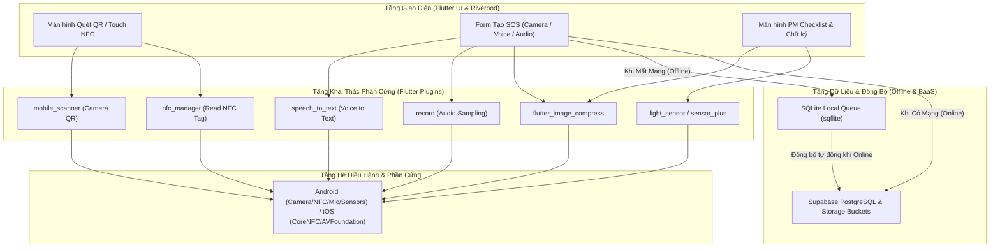

# AssetTrack - Tổng Hợp Kỹ Thuật Khai Thác Phần Cứng & Khả Năng Thiết Bị Di Động Trong Flutter

> **Tài liệu tổng hợp & ứng dụng lý thuyết lập trình di động Flutter (Chuyên đề Phần cứng & Thiết bị) vào Hệ thống Quản lý Lý lịch Thiết bị & Bảo trì Nhà máy (AssetTrack).**  
> **Thư mục lưu trữ:** `flutter/exercise-1/`

---

## 1. Tổng Quan Hệ Thống AssetTrack & Bối Cảnh Khai Thác Phần Cứng

**AssetTrack** là giải pháp di động đa nền tảng (Flutter & Supabase/Firebase) phục vụ quản lý lý lịch thiết bị, bảo trì phòng ngừa (PM) và xử lý sự cố khẩn cấp (Breakdown SOS) trong phân xưởng sản xuất quy mô vừa & nhỏ (SME).

Trong bối cảnh thực tế nhà máy sản xuất:
* **Công nhân vận hành (Operator)** và **Kỹ sư bảo trì (ME Engineer)** làm việc trong môi trường đặc thù (ồn ào, ánh sáng không đều, dính dầu mỡ, phải đeo găng tay bảo hộ, mạng Wi-Fi chập chờn).
* Thiết bị di động của nhân sự rất đa dạng (từ điện thoại Android giá rẻ đến iPhone cao cấp).

Do đó, việc ứng dụng các **Lý thuyết Khai thác Phần cứng & Khả năng Thiết bị Di động** (Sensors, Microphone/Audio, NFC, Camera/QR Code, Device Capability, Performance & Battery Optimization) đóng vai trò quyết định đến trải nghiệm người dùng (UX), độ tin cậy và hiệu năng của ứng dụng.

---

## 2. Tổng Hợp 5 Chuyên Đề Lý Thuyết & Ứng Dụng Chi Tiết Trong Dự Án AssetTrack

### 🟢 Chuyên Đề 1: Cảm Biến Môi Trường (Environmental Sensors - LT 15/30)

#### 1. Tóm tắt Lý thuyết Core:
* **Proximity Sensor (Cảm biến cận kế):** Phát hiện vật thể ở gần/xa (vd: tắt màn hình khi áp tai nghe gọi hoặc bỏ túi).
* **Ambient Light Sensor (Cảm biến ánh sáng môi trường):** Đo cường độ ánh sáng xung quanh ($\text{lux}$), tự động điều chỉnh độ sáng màn hình hoặc chuyển giao diện Ngày/Đêm (Day/Night Theme).
* **Barometer (Cảm biến áp suất):** Đo áp suất khí quyển ($\text{hPa}$), ước lượng độ cao.
* **Step Counter / Pedometer:** Đếm số bước chân và theo dõi di chuyển.
* **Kiến trúc luồng phần cứng Flutter:** `Flutter App (Dart)` $\rightarrow$ `Plugin/API (sensor_plus, light_sensor...)` $\rightarrow$ `Dịch vụ Hệ điều hành (Sensor Service)` $\rightarrow$ `Phần cứng (Hardware)`. Khuyến nghị dùng qua OS Service để HĐH xử lý hiệu chuẩn, lọc nhiễu và tiết kiệm pin.

#### 2. Áp dụng thực tế vào AssetTrack:
* **Tự động chuyển giao diện Chế độ Tối / Độ tương phản cao (Auto Dark/High-Contrast Mode):** Nhà xưởng sản xuất có các khu vực rất tối (dưới gầm máy dập, bên trong cabin điều khiển) hoặc khu vực rất sáng. Sử dụng `light_sensor` hoặc `sensor_plus` để đo cường độ ánh sáng:
  * Khi độ sáng $< 20\text{ lux}$ (ME chui vào gầm máy sửa chữa), app tự động chuyển sang **Dark Mode / High-Contrast Yellow-on-Black UI** giúp kỹ sư đọc checklist và sơ đồ máy dễ dàng không bị chói mắt.
* **Cảm biến cận kế (Proximity Sensor):** Khi Operator/ME đút điện thoại vào túi áo bảo hộ trong lúc đang vận hành máy hoặc di chuyển, ứng dụng tạm dừng lắng nghe cảm biến hoặc khóa cảm ứng để **tránh chạm nhầm nút Báo SOS (US-03)**.
* **Nguyên tắc kiểm tra tính sẵn có (Hardware Availability Check):** Không phải điện thoại công nhân nào cũng có Barometer hay Light Sensor. Ứng dụng phải dùng `sensor_plus: availableSensors` để kiểm tra trước khi đăng ký listener.

---

### 🎙️ Chuyên Đề 2: Microphone & Audio Input (LT 16/30)

#### 1. Tóm tắt Lý thuyết Core:
* **Nguyên lý:** Microphone chuyển tín hiệu Analog (sóng âm) $\rightarrow$ Digital (ADC) để xử lý.
* **Phân biệt Audio Recording vs. Speech Recognition:**
  * *Audio Recording (Ghi âm):* Lưu âm thanh thành file (`.wav`, `.m4a`, `.aac`), độ trễ thấp, xử lý offline (dùng package `record`, `flutter_sound`).
  * *Speech Recognition (Nhận dạng giọng nói):* Chuyển lời nói thành văn bản text real-time, yêu cầu kết nối mạng Cloud engine (dùng package `speech_to_text`).
* **Kỹ thuật & Tiêu chuẩn:** 
  * Định dạng: `.m4a`/`.aac` nén tốt cho di động; Sample rate: $16\text{ kHz}$ cho giọng nói; Channel: Mono ($1\text{ kênh}$) để tiết kiệm $50\%$ dung lượng.
  * Phải giải phóng tài nguyên (`recorder.dispose()`) khi không sử dụng để tránh leak mic và crash app.
* **Quyền riêng tư (Permissions):** Android `RECORD_AUDIO`, iOS `NSMicrophoneUsageDescription`. Phải xin quyền đúng thời điểm và minh bạch.

#### 2. Áp dụng thực tế vào AssetTrack:
* **Nhập liệu bằng giọng nói (Voice-to-Text Input - US-03, US-05, US-07):** 
  * Kỹ sư ME và Operator thường xuyên **đeo găng tay bảo hộ dính dầu mỡ**, rất khó gõ bàn phím ảo.
  * Tích hợp `speech_to_text` vào khung nhập **Mô tả sự cố SOS**, **Ghi chú PM Checklist** và **Lý do đề xuất linh kiện**. Người dùng chỉ cần nhấn giữ nút Mic và nói: *"Máy dập MC-102 bị rò rỉ dầu van áp suất số 2"*, hệ thống tự điền text vào form.
* **Ghi âm tiếng động lạ của máy (Audio Diagnostics Attachment - US-03):** 
  * Cho phép Operator ghi âm $5 - 10\text{ giây}$ tiếng động bất thường của máy (tiếng rít curoa, gõ gầm máy) và đính kèm vào phiếu SOS.
  * Tối ưu kỹ thuật theo **NFR-04**: Ghi âm dạng Mono AAC $16\text{ kHz}$ dung lượng $< 500\text{ KB}$, upload lên Supabase Storage bucket `failure-photos`.
* **Quản lý vòng đời Recorder:** Đóng stream ngay khi hoàn tất ghi âm để giải phóng Audio Session cho các ứng dụng khác.

---

### 📱 Chuyên Đề 3: Thiết Bị Không Đồng Nhất (Device Capability - LT 07/30)

#### 1. Tóm tắt Lý thuyết Core:
* **Thực tế:** Môi trường Android/iOS rất đa dạng (từ điện thoại giá rẻ, trung cấp đến cao cấp). Không được giả định mọi máy đều có camera xịn, NFC, Biometrics, Gyroscope...
* **Quy tắc xử lý chuẩn (Best Practice):**
  1. Kiểm tra Capability trước khi gọi API (dùng `device_info_plus` hoặc API plugin check).
  2. Ẩn / Disable tính năng không được thiết bị hỗ trợ.
  3. Fallback hợp lý sang phương án thay thế.
  4. Cung cấp phản hồi UX minh bạch (thông báo rõ lý do vì sao tính năng không khả dụng).

#### 2. Áp dụng thực tế vào AssetTrack:
* **Phương án Fallback cho Quét mã QR / NFC (US-01):**
  * *Trường hợp 1 (Camera hỏng/kém/mờ dầu mỡ):* Nếu camera thiết bị không tự động lấy nét được mã QR trên máy, giao diện tự động hiển thị nút **"Nhập mã máy thủ công"** (ví dụ nhập `MC-102`) hoặc **"Chọn từ danh sách phân xưởng"**.
  * *Trường hợp 2 (NFC Capability):* Máy cao cấp có thể chạm NFC Tag để mở Hộ chiếu thiết bị. Nếu kiểm tra `await NfcManager.instance.isAvailable()` trả về `false` (máy không có NFC), ứng dụng tự động ẩn icon chạm NFC và mặc định mở Camera quét QR Code.
* **Xác thực Sinh trắc học (Biometrics Sign-off - US-08, US-10):**
  * Quản đốc (Supervisor) có thể dùng Vân tay / FaceID để phê duyệt nhanh phiếu nghiệm thu. Nếu máy không có cảm biến sinh trắc học, ứng dụng tự động fallback về **Nhập mã PIN 6 số**.

---

### 📶 Chuyên Đề 4: NFC, RFID & Giao Tiếp Tầm Ngắn (LT 23/30)

#### 1. Tóm tắt Lý thuyết Core:
* **NFC (Near Field Communication):** Chuẩn giao tiếp không dây khoảng cách cực ngắn ($0 - 4\text{ cm}$), tần số $13.56\text{ MHz}$.
* **Chế độ:** Read (Đọc tag), Write (Ghi tag), Peer-to-Peer.
* **So sánh công nghệ:**
  * *NFC:* Chạm là kết nối ( $< 0.1\text{s}$), khoảng cách $0 - 4\text{cm}$, độ bền cao (thẻ NFC đúc nhựa chống nước/dầu mỡ nhà xưởng).
  * *QR Code:* Quét qua camera ($1 - 1.5\text{s}$), khoảng cách $5 - 100\text{cm}$, chi phí in ấn rẻ nhưng dễ bị mờ/bẩn dầu mỡ.
  * *BLE (Bluetooth Low Energy):* Khoảng cách xa $1 - 100\text{m}$, dùng cho định vị/giám sát diện rộng.
* **Package khuyến nghị:** `nfc_manager`.
* **UX Rules:** Hướng dẫn rõ ràng ("Đưa thiết bị lại gần thẻ"), phản hồi haptic (Rung nhẹ) + Âm thanh báo thành công.

#### 2. Áp dụng thực tế vào AssetTrack:
* **Song hành NFC Tag & QR Code dán trên máy (QR/NFC Machine Passport - US-01):**
  * Trên mỗi máy móc trong nhà xưởng (vd: `MC-102`), dán tem kết hợp vừa có **Mã QR** vừa nhúng **Thẻ NFC nhựa công nghiệp (Chống dầu mỡ, va đập)**.
  * Công nhân / ME Engineer chạm nhẹ điện thoại vào thẻ NFC $\rightarrow$ App dùng `nfc_manager` đọc chuỗi NDEF URI `assettrack://machine/MC-102` $\rightarrow$ Mở trực tiếp màn hình Hộ chiếu thiết bị trong ** $< 0.5\text{ giây}$**, nhanh hơn và bền hơn quét QR trong điều kiện nhà xưởng thiếu sáng/bẩn tem.
* **Xác thực Thẻ Nhân Viên NFC (NFC Employee Check-in - US-14):**
  * Supervisor dùng điện thoại quẹt thẻ đeo nhân viên (NFC Tag) của công nhân mới để **cấp tài khoản & gán quyền nhanh vào phân xưởng** mà không cần gõ Email/Mã NV thủ công.

---

### ⚡ Chuyên Đề 5: Hiệu Năng, Pin, Nhiệt & Quyền Riêng Tư (LT 08/30)

#### 1. Tóm tắt Lý thuyết Core:
* **Các tác vụ tốn PIN & gây nóng máy:** Camera/Video bật liên tục, GPS High-accuracy, BLE/Wi-Fi Scan liên tục, Sensor Sampling tần số cao, Upload file dung lượng lớn.
* **Chiến lược tối ưu hóa:**
  1. *Chỉ bật phần cứng khi cần & Dừng đúng lúc:* Đóng camera controller ngay sau khi quét xong QR.
  2. *Throttling & Debouncing:* Giới hạn tần số cập nhật UI và trigger sự kiện.
  3. *Resize/Compress ảnh:* Nén ảnh client trước khi upload server.
  4. *Offline Local Cache:* Lưu cache local tránh gọi API liên tục.
* **Quyền riêng tư (Privacy):** Xin quyền minh bạch, không thu thập dữ liệu ngầm, bảo vệ dữ liệu nhạy cảm.

#### 2. Áp dụng thực tế vào AssetTrack:
* **Tối ưu Camera Quét QR (Tuân thủ NFR-03 & NFR-05):**
  * Ngay khi thư viện `mobile_scanner` phát hiện và decode thành công mã QR `MC-102`, ứng dụng lập tức gọi `controller.stop()` để **tắt cảm biến camera**. Tránh việc camera chạy ngầm gây tốn pin và nóng máy khi công nhân để ứng dụng ở màn hình Passport.
* **Nén Ảnh Sự Cố & Chữ Ký Điện Tử (Tuân thủ NFR-04):**
  * Ảnh chụp hiện trạng hỏng hóc từ camera (US-03) và ảnh bằng chứng bảo dưỡng (US-05) được nén qua `flutter_image_compress` về độ phân giải $1280 \times 720$, chất lượng $80\%$ (dung lượng $< 1\text{ MB}$, thỏa mãn NFR-04 $< 5\text{ MB}$).
  * Canvas chữ ký (`signature` package) của Supervisor (US-08) được nén xuất file PNG chuẩn $300 \times 150\text{px}$ tối ưu dung lượng.
* **Cơ chế Offline Sync Queue Tiết Kiệm Pin (Tuân thủ NFR-06):**
  * Khi nhà máy bị mất mạng, phiếu SOS và chỉ số giờ chạy được lưu vào **SQLite Queue** (`sqflite`).
  * Tránh dùng vòng lặp polling kiểm tra mạng (tốn pin). Thay vào đó, dùng `connectivity_plus` đăng ký Stream lắng nghe sự kiện mạng đổi sang `online` $\rightarrow$ Đẩy toàn bộ dữ liệu Queue lên Supabase một lần duy nhất và ngắt kết nối.
* **Bảo mật & Phân quyền RLS (Tuân thủ NFR-01):**
  * Mọi dữ liệu phân xưởng được cách ly bằng Supabase Row-Level Security (`workshop_id`). Không lưu plain text mật khẩu hoặc thông tin nhạy cảm ở Local Storage.

---

## 3. Bảng Ánh Xạ Tính Năng AssetTrack & Lý Thuyết Khai Thác Phần Cứng

| Mã US / NFR | Tên Tính Năng AssetTrack | Chuyên Đề Phần Cứng Áp Dụng | Giải Pháp Kỹ Thuật & Flutter Package |
| :--- | :--- | :--- | :--- |
| **US-01** | Quét Hộ thông tin máy (Machine Passport) | LT 23 (NFC) & LT 07 (Device Capability) & LT 08 (Hiệu năng) | • Quét QR Code (`mobile_scanner`) hoặc Chạm NFC (`nfc_manager`). • Tắt camera ngay sau khi decode. • Fallback sang nhập tay mã máy nếu camera/NFC hỏng. |
| **US-03** | Tạo Phiếu Báo Lỗi SOS Khẩn Cấp | LT 16 (Microphone) & LT 08 (Nén ảnh/file) | • Nhập mô tả bằng giọng nói (`speech_to_text`). • Ghi âm tiếng động lạ của máy (`record` - Mono 16kHz AAC). • Nén ảnh hiện trường $< 1\text{MB}$ (`flutter_image_compress`). |
| **US-05** | Thực Hiện PM Checklist & Tải Ảnh | LT 16 (Speech-to-Text) & LT 08 (Compress) | • Tích chọn checklist & nhập ghi chú bằng giọng nói. • Chụp ảnh linh kiện cũ/mới, nén client trước khi upload Supabase Storage. |
| **US-08** | Nghiệm Thu & Ký Tên Điện Tử | LT 07 (Biometrics Fallback) & LT 08 (Canvas PNG) | • Xác thực sinh trắc học (Vân tay/FaceID) hoặc mã PIN. • Xuất ảnh chữ ký PNG $300 \times 150\text{px}$ từ `signature` canvas. |
| **US-14** | Quản Lý & Import Nhân Viên | LT 23 (NFC Employee Card) | • Quẹt thẻ nhân viên NFC để cấp quyền nhanh cho công nhân trong xưởng. |
| **NFR-01** | Bảo Mật & Phân Quyền | LT 08 (Privacy & Security) | • Phân quyền Row-Level Security (RLS) theo `workshop_id` & Firebase/Supabase Auth. |
| **NFR-03** | Hiệu Năng Quét QR $< 1.5\text{s}$ | LT 08 (Camera Management) | • Tối ưu camera resolution (`ResolutionPreset.medium`), stop scanner ngay khi xong. |
| **NFR-04** | Dung Lượng File $< 5\text{MB}$ | LT 16 (Audio Mono AAC) & LT 08 (Compress) | • Client-side compression cho cả Ảnh (JPEG 80%) và Audio (AAC 16kHz). |
| **NFR-06** | Offline Queue & Tự Đồng Bộ | LT 08 (Offline Cache & Energy) | • Dùng SQLite (`sqflite`) lưu queue offline. • Lắng nghe `connectivity_plus` trigger sync, không poll lặp tránh hao pin. |
| **UX-UI** | Giao Diện Nhà Xưởng Linh Hoạt | LT 15 (Ambient Light Sensor) | • Tự động đổi Dark Mode / Yellow-High-Contrast UI khi ánh sáng môi trường $< 20\text{ lux}$. |

---

## 4. Kiến Trúc Luồng Dữ Liệu Tích Hợp Phần Cứng Trong Flutter App

---

## 5. Kết Luận & Bài Học Kinh Nghiệm Kỹ Thuật

1. **Đơn giản hóa trải nghiệm cho môi trường nhà máy:** Nhập liệu giọng nói (Speech-to-Text) và chạm NFC/QR Code giúp giảm thời gian thao tác của công nhân/kỹ sư từ 2 phút xuống dưới 10 giây.
2. **Luôn chuẩn bị phương án Fallback (Graceful Degradation):** Không bao giờ tin tưởng 100% thiết bị đều có NFC hay Camera sắc nét. Luôn có phương án nhập mã máy thủ công và nhập PIN thay sinh trắc học.
3. **Tối ưu hóa phần cứng là bảo vệ Pin & Nhiệt độ máy:** Luôn ngắt Camera Controller, đóng Audio Stream và giải phóng Sensor Listener khi Widget bị `dispose`. Nén toàn bộ media ở client trước khi upload để tiết kiệm băng thông mạng 4G/Wi-Fi nhà xưởng.
