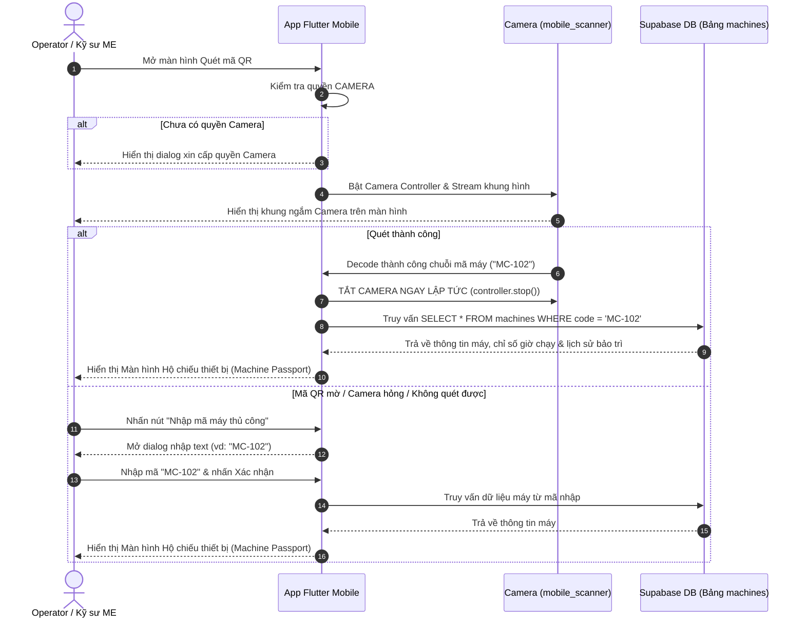

# AssetTrack - Báo Cáo Phân Tích & Ứng Dụng Kỹ Thuật Quét Mã QR Thiết Bị Trong Flutter

> **Tài liệu báo cáo thực hành & phân tích lý thuyết chuyên đề phần cứng di động:** Tập trung phân tích chuyên sâu tính năng **Quét mã QR Code bằng Camera (Machine Passport)** — tính năng phần cứng duy nhất được nhóm lựa chọn áp dụng thực tế trong dự án AssetTrack.  
> **Thư mục lưu trữ:** `flutter/exercise-1/README.md`

---

## 1. Bối Cảnh Thực Tế & Quyết Định Lựa Chọn Phần Cứng Của Nhóm

Trong dự án **AssetTrack** (Hệ thống Quản lý Lý lịch Thiết bị & Bảo trì Nhà máy), qua khảo sát bối cảnh vận hành thực tế tại phân xưởng sản xuất quy mô vừa & nhỏ (SME):
* Thiết bị di động của công nhân vận hành (Operator) và kỹ sư bảo trì (ME Engineer) rất đa dạng (nhiều máy Android phổ thông / giá rẻ).
* Nhóm quyết định **chỉ áp dụng duy nhất 1 tính năng khai thác phần cứng:** **Quét mã QR Code bằng Camera thiết bị di động** để tra cứu nhanh thông tin & Hộ chiếu thiết bị (Machine Passport).
* Các phần cứng nâng cao khác (NFC, Microphone/Ghi âm, Cảm biến ánh sáng, Pedometer, Vân tay...) **không áp dụng** nhằm tối ưu chi phí triển khai, giảm độ phức tạp ứng dụng và đảm bảo $100\%$ thiết bị của nhân sự trong xưởng đều sử dụng được ngay.

---

## 2. Ánh Xạ Lý Thuyết Chuyên Đề Vào Tính Năng Quét Mã QR Của Dự Án

Mặc dù nhóm chỉ áp dụng tính năng Quét mã QR, tính năng này liên kết chặt chẽ và phản ánh đầy đủ các bài học cốt lõi từ 5 chuyên đề lý thuyết phần cứng:

### 📸 1. Phân tích theo Chuyên đề Device Capability - Thiết bị không đồng nhất (LT 07/30)
* **Tính phổ quát của phần cứng:** Camera là phần cứng tiêu chuẩn có mặt trên $100\%$ điện thoại thông minh hiện nay. Lựa chọn quét QR giúp ứng dụng chạy được trên mọi thiết bị mà không lo bị thiếu hụt phần cứng.
* **Xử lý Quyền & Khả năng truy cập (Permission & Capability Check):**
  * Ứng dụng kiểm tra và xin quyền `CAMERA` minh bạch trước khi mở màn hình quét.
  * Nếu người dùng từ chối cấp quyền camera, ứng dụng hiển thị thông báo UX rõ ràng hướng dẫn truy cập Cài đặt hệ thống để bật quyền.
* **Cơ chế Fallback (Xử lý khi camera không quét được):**
  * Trong môi trường nhà xưởng, tem QR dán trên máy có thể bị mờ, dính dầu mỡ hoặc camera thiết bị bị hỏng/không lấy nét được.
  * **Giải pháp Fallback:** Trên màn hình quét QR, nhóm thiết kế sẵn tùy chọn **"Nhập mã máy thủ công"** (ví dụ: gõ `MC-102`) hoặc **"Chọn máy từ danh sách phân xưởng"** để đảm bảo công việc không bị gián đoạn.

### ⚡ 2. Phân tích theo Chuyên đề Hiệu năng, Pin & Quản lý Camera (LT 08/30)
* **Thách thức:** Camera là một trong những tác vụ tốn PIN nhất và gây nóng máy nhanh nhất trên thiết bị di động do phải xử lý khung hình liên tục (frame streaming).
* **Giải pháp quản lý vòng đời Camera trong Flutter (`mobile_scanner`):**
  * **Tắt Camera ngay sau khi Decode:** Ngay khi camera nhận diện và decode thành công chuỗi ký tự mã máy (vd: `MC-102`), ứng dụng lập tức gọi hàm dừng `cameraController.stop()` hoặc `dispose()`.
  * **Tối ưu tốc độ nhận diện (NFR-03):** Cấu hình độ phân giải camera ở mức tối ưu (`ResolutionPreset.medium`), giúp camera decode mã QR trong thời gian $< 1.5\text{ giây}$ mà không gây ngốn RAM hay giật lag UI.
  * **Giải phóng tài nguyên:** Khi người dùng chuyển sang màn hình khác hoặc đóng app, Camera Controller được giải phóng hoàn toàn để tránh chạy ngầm gây hao pin.

### 📶 3. Phân tích theo Chuyên đề NFC vs. QR Code (LT 23/30)
* **So sánh kỹ thuật giữa QR Code và NFC:**
  | Tiêu chí | Quét mã QR Code (Nhóm chọn) | Giao tiếp tầm ngắn NFC |
  | :--- | :--- | :--- |
  | **Phần cứng yêu cầu** | Camera (Phổ biến $100\%$) | Đầu đọc NFC Reader (Chỉ có ở máy tầm trung / cao cấp) |
  | **Chi phí triển khai** | $0\text{ VNĐ}$ (In decal/giấy dán lên máy) | Phải mua thẻ NFC chip nhựa đúc ($15.000 - 30.000\text{đ}$/thẻ) |
  | **Khoảng cách quét** | $5 - 100\text{ cm}$ (Bảo đảm an toàn khi máy đang chạy) | $0 - 4\text{ cm}$ (Phải áp sát điện thoại vào máy) |
  | **Tốc độ decode** | $< 1.5\text{ giây}$ | $< 0.5\text{ giây}$ |
  | **Khả năng thay thế** | Dễ dàng in lại mã mới khi bị mất/hỏng | Phải nạp lại dữ liệu NDEF vào thẻ mới |

* **Lý do nhóm quyết định chọn QR Code:**
  1. **Độ an toàn lao động:** Kỹ sư/Công nhân đứng cách máy $30 - 50\text{cm}$ vẫn quét được mã QR, không cần áp sát tay/điện thoại vào máy móc đang vận hành như NFC ($0 - 4\text{cm}$).
  2. **Tiết kiệm chi phí:** In tem mã QR dán lên 50 máy trong phân xưởng với chi phí cực rẻ.
  3. **Tương thích tuyệt đối:** 100% nhân sự trong xưởng đều dùng được ngay trên điện thoại cá nhân.

### 🔇 4. Đánh giá các phần cứng KHÔNG áp dụng (LT 15/30, LT 16/30)
* **Microphone / Ghi âm & Voice-to-Text (LT 16):** Môi trường nhà xưởng sản xuất có độ ồn cao (tiếng máy dập, máy nén khí), việc thu âm hoặc nhận dạng giọng nói dễ bị nhiễu sai lệch. Do đó nhóm dùng phím chọn form chuẩn thay vì microphone.
* **Cảm biến môi trường / Pedometer (LT 15):** Điện thoại nhà xưởng không cần đếm bước chân hay đo áp suất khí quyển. Độ sáng màn hình được quản lý tự động bởi HĐH.

---

## 3. Quy Trình Kỹ Thuật Quét Mã QR Hộ Chiếu Thiết Bị (Machine Passport Flow)

---

## 4. Bảng Tổng Hợp Chi Tiết Triển Khai Kỹ Thuật Tính Năng Quét QR

| Hạng mục | Chi tiết kỹ thuật trong dự án AssetTrack |
| :--- | :--- |
| **Tên tính năng** | Quét mã QR Hộ chiếu Thiết bị (QR Machine Passport - US-01) |
| **Đối tượng sử dụng** | Công nhân vận hành (Operator), Kỹ sư bảo trì (ME Engineer), Quản đốc (Supervisor) |
| **Thư viện Flutter sử dụng** | `mobile_scanner: ^5.0.0` (dùng cho cả Android & iOS) |
| **Độ phân giải Camera** | `ResolutionPreset.medium` (cân bằng giữa tốc độ decode và tiết kiệm pin) |
| **Thời gian decode (NFR-03)** | $< 1.5\text{ giây}$ trong điều kiện ánh sáng nhà máy bình thường |
| **Quản lý tài nguyên Pin/Nội năng** | Gọi `controller.stop()` ngay khi phát hiện mã QR đầu tiên; dispose controller khi unmount widget |
| **Cơ chế Fallback (LT 07)** | Hỗ trợ nhập mã chuỗi (Text input: `MC-102`) hoặc chọn từ danh sách dropdown |
| **Định dạng dữ liệu mã QR** | Chuỗi JSON hoặc Plain Text mã máy (ví dụ: `MC-102`, `MC-205`) |

---

## 5. Kết Luận

Việc tập trung vào **Quét mã QR bằng Camera** là lựa chọn thiết thực, phù hợp nhất với nguồn lực và bối cảnh phân xưởng sản xuất SME. Mặc dù chỉ khai thác 1 tính năng phần cứng, giải pháp của nhóm vẫn đảm bảo áp dụng đúng các nguyên tắc kỹ thuật nâng cao:
1. **Kiểm tra capability & Xử lý fallback mềm dẻo** (LT 07).
2. **Tắt camera đúng lúc để bảo vệ Pin & Nhiệt độ thiết bị** (LT 08).
3. **Đánh giá đúng ưu thế chi phí và khoảng cách an toàn của QR Code so với NFC** (LT 23).
