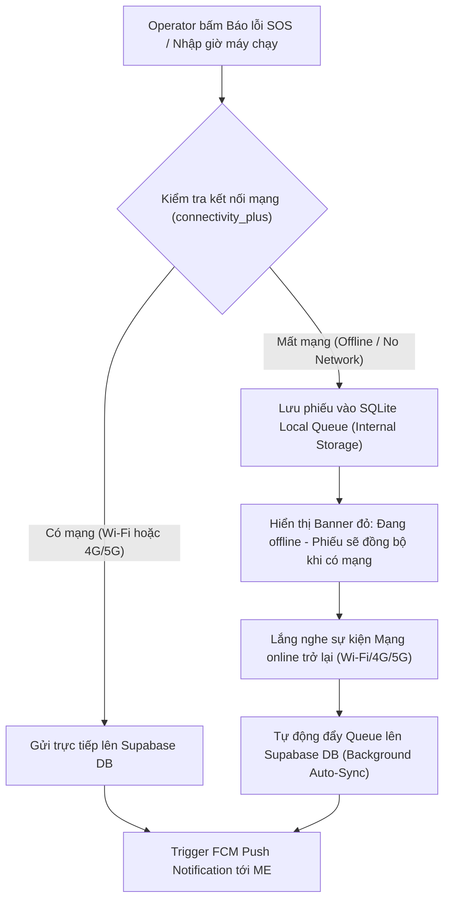
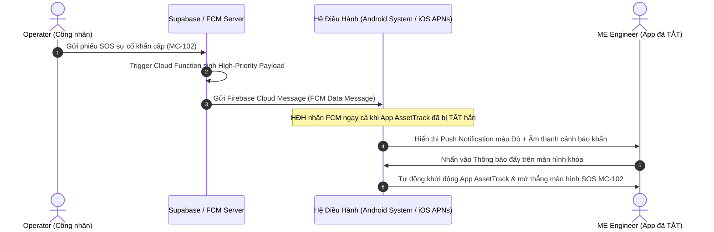

# AssetTrack - Báo Cáo Phân Tích & Ứng Dụng Kỹ Thuật Khai Thác Phần Cứng & Hạ Tầng Di Động Trong Flutter

> **Tài liệu báo cáo thực hành & phân tích lý thuyết chuyên đề di động:** Phân tích chi tiết tính năng **Quét mã QR Code bằng Camera**, hạ tầng **Kết nối mạng (Wi-Fi, 4G/5G & Sync Offline)**, mô hình **Lưu trữ Bộ nhớ (Internal & External Storage)** và cơ chế **Thông báo Đẩy & Tác vụ Ngầm (Push Notifications & Background Work)** áp dụng thực tế trong dự án AssetTrack.  
> **Thư mục lưu trữ:** `flutter/exercise-1/README.md`

---

## 1. Bối Cảnh Thực Tế & Quyết Định Triển Khai Phần Cứng Của Dự Án

Trong hệ thống **AssetTrack** (Quản lý Lý lịch Thiết bị & Bảo trì Nhà máy SME):
* Nhân sự vận hành (Operator) và bảo trì (ME Engineer) làm việc trong phân xưởng sản xuất có độ phủ Wi-Fi không đều, tín hiệu 4G/5G chập chờn ở một số khu vực gầm máy.
* Thiết bị di động đa dạng (nhiều máy Android giá rẻ), nhân sự có thói quen **tắt ứng dụng (Killed / Terminated state)** khi không dùng để tiết kiệm pin.

**Danh mục phần cứng & hạ tầng di động nhóm lựa chọn áp dụng:**
1. **Camera:** Quét mã QR Code tra cứu thông tin máy (Machine Passport - US-01).
2. **Kết nối Mạng & Đồng bộ Offline (Wi-Fi, 4G/5G & SQLite Queue):** Đảm bảo app hoạt động mượt mà cả khi mất mạng và tự động đồng bộ khi online.
3. **Mô hình Lưu trữ Bộ nhớ (Internal vs External Storage):** Quản lý SQLite DB, Cache, Token bảo mật và File xuất báo cáo QR/Downtime.
4. **Thông báo Đẩy Ngầm (FCM Push Notifications & Background Work):** Nhận thông báo sự cố SOS tức thì ($< 3\text{s}$) ngay cả khi ứng dụng bị tắt hoàn toàn.

---

## 2. Phân Tích Kỹ Thuật & Ánh Xạ Lý Thuyết Chuyên Đề

### 📸 1. Camera & Quét Mã QR Code Thiết Bị (LT 07, LT 08, LT 23)
* **Tính phổ quát & Tiết kiệm chi phí (LT 07 & LT 23):** Camera có mặt trên $100\%$ điện thoại. Sử dụng QR Code giúp tiết kiệm $100\%$ chi phí mua thẻ NFC, giữ khoảng cách an toàn $30-50\text{cm}$ cho nhân sự khi quét máy đang chạy.
* **Tắt Camera ngay sau khi Decode (LT 08 - Tối ưu Pin & Nhiệt):** 
  * Ngay khi `mobile_scanner` nhận diện thành công mã `MC-102`, ứng dụng gọi `cameraController.stop()` để **tắt camera ngay lập tức**, tránh gây nóng máy và hao pin.
  * Tốc độ decode $< 1.5\text{ giây}$ (tuân thủ NFR-03).
* **Cơ chế Fallback (LT 07):** Nếu tem QR bị mờ hoặc camera hỏng, ứng dụng tự động hiển thị tùy chọn **"Nhập mã máy thủ công"** (gõ `MC-102`) hoặc **"Chọn máy từ danh sách"**.

---

### 📶 2. Quản Lý Kết Nối Mạng (Wi-Fi, 4G/5G) & Tự Động Đồng Bộ Offline (NFR-06)



* **Phát hiện trạng thái mạng Real-time (`connectivity_plus`):**
  * Ứng dụng liên tục theo dõi sự thay đổi trạng thái kết nối mạng giữa **Wi-Fi**, **Mạng di động (4G/5G)** và **Mất mạng (None)**.
* **Xử lý khi Mất mạng (Offline Mode):**
  * Khi Operator nhập số giờ chạy hoặc gửi phiếu SOS khẩn cấp lúc không có mạng, dữ liệu được ghi ngay vào **SQLite Local Queue** dưới bộ nhớ trong.
  * Giao diện xuất hiện **Banner cảnh báo đỏ (NFR-06):** *"⚠️ Không có mạng — Phiếu SOS sẽ được lưu tạm và tự động gửi tới kỹ sư sau khi kết nối Wi-Fi/4G trở lại."*
* **Tự động Đồng bộ (Idempotent Auto-Sync):**
  * Ngay khi thiết bị kết nối lại mạng Wi-Fi hoặc 4G/5G, ứng dụng tự động kích hoạt tiến trình đọc Queue và push dữ liệu lên Supabase.
  * Mỗi bản ghi gắn 1 mã duy nhất `client_generated_id` (UUIDv4) để chống tạo trùng lặp dữ liệu khi sync lại nhiều lần.

---

### 💾 3. Mô Hình Lưu Trữ Bộ Nhớ: Internal Storage vs External Storage

Ứng dụng phân chia lưu trữ minh bạch theo nguyên tắc quản lý bộ nhớ Android/iOS:

```
📱 BỘ NHỚ THIẾT BỊ DI ĐỘNG (STORAGE ARCHITECTURE)
├── 🔒 Internal Storage (Bộ nhớ trong nội bộ App - Private)
│   ├── SQLite Database (assettrack_offline.db) ──► Lưu Queue offline, Cache Machine Passport
│   ├── FlutterSecureStorage / SharedPreferences ──► Lưu Auth Token, User Role (operator/me/supervisor)
│   └── Temporary Cache Directory (path_provider) ──► Lưu ảnh chụp sự cố nén tạm trước khi upload
│
└── 📁 External Storage (Bộ nhớ ngoài / Public Directory)
    ├── Downloads / AssetTrack_Exports/ ──────────► Lưu xuất file báo cáo Downtime (.pdf / .xlsx)
    └── Machine_QR_Codes/ ───────────────────────► Lưu file ảnh QR Code exported để in ấn dán lên máy
```

#### A. Internal Storage (Bộ nhớ trong - Riêng tư của App)
* **Vị trí & Thư viện:** Dùng `path_provider` (`getApplicationDocumentsDirectory()`) kết hợp SQLite (`sqflite`).
* **Mục đích sử dụng:**
  * **SQLite Database (`assettrack_offline.db`):** Lưu trữ hàng chờ (Offline Sync Queue) cho phiếu SOS, nhật ký giờ chạy máy và bản cache offline của 50 Hộ chiếu máy.
  * **Secure Storage:** Lưu Auth Session Token, User ID và Vai trò (`operator`, `me_engineer`, `supervisor`).
* **Đặc tính:** Bảo mật tuyệt đối, các ứng dụng khác không thể truy cập, không bị các app dọn rác (Clean Master) xóa nhầm, tự động giải phóng sạch sẽ khi gỡ ứng dụng.

#### B. External Storage (Bộ nhớ ngoài / Dung lượng dùng chung)
* **Vị trí & Thư viện:** Dùng `path_provider` (`getExternalStorageDirectory()`) kết hợp cấp quyền Android `READ/WRITE_EXTERNAL_STORAGE` (hoặc Scoped Storage trên Android 10+).
* **Mục đích sử dụng:**
  * **Xuất file Báo cáo Downtime (Supervisor):** Lưu các file báo cáo tổng hợp thời gian dừng máy phân xưởng dạng PDF/Excel vào thư mục `Downloads/AssetTrack/` để Quản đốc in hoặc gửi mail.
  * **Xuất ảnh Mã QR Thiết bị:** Lưu file ảnh QR Code của máy móc ra bộ nhớ máy để mang đi in tem decal dán lên thân máy.
* **Đặc tính:** Người dùng có thể xem, chia sẻ và sao chép file ra máy tính cá nhân dễ dàng qua ứng dụng Quản lý File (File Manager).

---

### 🔔 4. Thông Báo Đẩy & Tác Vụ Ngầm Khi Tắt Ứng Dụng (Push Notifications & Background Work)

#### A. Gửi Push Notification Khẩn Cấp Khi App Bị Tắt (FCM Terminated/Background State - NFR-02, US-04)
* **Bối cảnh:** Kỹ sư bảo trì (ME Engineer) không thể mở app 24/7. Họ thường xuyên thoát ứng dụng hoặc tắt hẳn app (Killed/Terminated State).
* **Cơ chế hoạt động:**



* **Cấu hình Kỹ thuật:**
  1. Sử dụng **Firebase Cloud Messaging (FCM)** kết hợp `flutter_local_notifications`.
  2. Đăng ký Handler ngầm tĩnh: `@pragma('vm:entry-point') Future<void> _firebaseMessagingBackgroundHandler(RemoteMessage message)`.
  3. Cấu hình Channel Notification mức ưu tiên cao nhất (`Importance.max`, `Priority.high`) để phát âm thanh chuông báo động sự cố ngay cả khi thiết bị đang ở chế độ chờ (Sleep/Background) hoặc tắt ứng dụng.
  4. **Giải quyết Race Condition (US-04):** Khi ME nhấn notification mở app, ứng dụng thực hiện Firestore/Supabase Transaction `UPDATE work_orders SET assignee_id = me_id WHERE status = 'pending'`. Nếu phiếu đã có kỹ sư khác nhận trước, app thông báo: *"Phiếu đã được tiếp nhận bởi kỹ sư khác"*.

#### B. Tác Vụ Ngầm Đồng Bộ Dữ Liệu (Background Work & Offline Queue Recovery)
* Khi ứng dụng khởi động lại hoặc chạy ngầm (dùng `workmanager` / `Connectivity` listener), tiến trình ngầm tự động quét lại SQLite Queue để đẩy các phiếu còn sót do mất mạng trước đó lên server mà không cần người dùng thao tác lại.

---

## 3. Bảng Tổng Hợp Chi Tiết Triển Khai Kỹ Thuật

| Hạng mục Hạ tầng | Công nghệ / Package | Vai trò & Kịch bản thực tế trong AssetTrack |
| :--- | :--- | :--- |
| **Quét mã QR Máy** | `mobile_scanner: ^5.0.0` | Quét mã tra cứu Hộ chiếu thiết bị (US-01); tự ngắt camera giải phóng pin (LT 08); fallback nhập mã tay `MC-102` (LT 07). |
| **Kiểm tra Mạng** | `connectivity_plus: ^6.0.0` | Lắng nghe real-time kết nối Wi-Fi, 4G/5G, Offline. Cảnh báo banner đỏ khi mất mạng (NFR-06). |
| **Lưu trữ Nội bộ (Internal)** | `sqflite: ^2.3.0`<br>`path_provider: ^2.1.0`<br>`flutter_secure_storage` | Lưu SQLite Offline Queue, cache 50 máy xưởng, lưu Session Auth Token bảo mật tuyệt đối không bị dọn rác xóa. |
| **Lưu trữ Bộ nhớ ngoài (External)** | `path_provider`<br>`permission_handler` | Lưu các file xuất báo cáo Downtime PDF/Excel, xuất ảnh QR Code máy ra thư mục `Downloads/` để in ấn dán máy. |
| **Push Notification Ngầm** | `firebase_messaging: ^15.0.0`<br>`flutter_local_notifications` | Nhận thông báo sự cố SOS khẩn cấp trong $< 3\text{s}$ (NFR-02) kể cả khi app bị **TẮT HẲN** (Terminated state). |
| **Tác vụ Ngầm (Background Work)** | `@pragma('vm:entry-point')` Background Handler | Tự động đọc SQLite queue và retry sync dữ liệu khi có kết nối mạng trở lại. |

---

## 4. Kết Luận

Bản bổ sung đã hoàn thiện bức tranh hạ tầng kỹ thuật di động cho dự án **AssetTrack**:
1. **Camera QR Code:** Tối ưu hiệu năng, tắt camera đúng lúc, fallback linh hoạt.
2. **Wi-Fi & 4G/5G Sync:** Đảm bảo ứng dụng chạy xuyên suốt cả khi mất mạng nhờ SQLite Queue và cơ chế tự đồng bộ.
3. **Internal vs External Storage:** Phân định rõ ràng nơi lưu dữ liệu bảo mật (SQLite/Auth Token) và nơi lưu file xuất ra ngoài (Báo cáo/Mã QR).
4. **FCM Background Work:** Đảm bảo Kỹ sư bảo trì không bị bỏ lỡ thông báo sự cố khẩn cấp ngay cả khi đã tắt ứng dụng.
